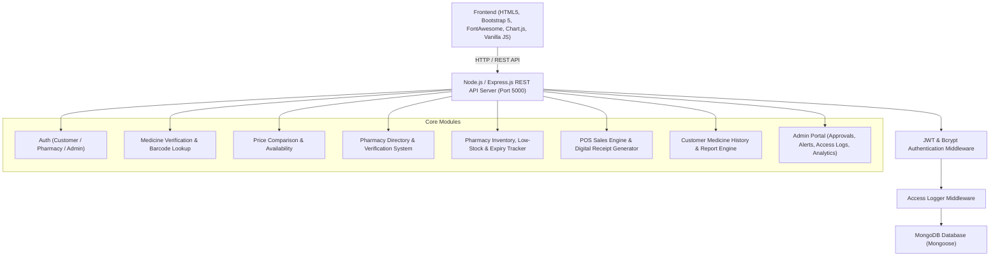

# Implementation Plan: MedCheck BD Full-Stack Web Application

Build a complete, professional, modern, and functional Bangladesh-focused Medicine Verification, Price, Availability, and Pharmacy Management platform connecting **Customer → Pharmacy → Admin**.

## User Review Required

> [!IMPORTANT]
> - **Self-Contained Database**: Since standard local MongoDB daemons may not always be running on developer machines, the backend connection (`server/config/db.js`) will support standard `MONGODB_URI` environment variable, with automated fallback to `mongodb-memory-server` if local MongoDB is unreachable. This guarantees immediate zero-setup execution with `npm install` and `npm start`.
> - **Realistic Bangladesh Demo Dataset**: Realistically seeded with 20+ well-known Bangladeshi medicines (Napa, Napa Extra, Seclo, Maxpro, Sergel, Ace Plus, Fexo, Monas, Pantonix, Ceevit, etc.), 5 top pharma companies (Beximco, Square, Incepta, Renata, Opsonin), 10 Dhaka and divisional pharmacies, verified batch numbers, active alert flags, and sample customer reports.
> - **Medical Verification Disclaimer**: Strictly complies with health-tech guidelines: uses "Database Match", "Verification Status", and "Alert Information" badges instead of claiming 100% physical authenticity.

## Architecture Overview

## Proposed Changes

### Project Root & Configuration
Located at `C:\Users\User\.gemini\antigravity\scratch\medcheck-bd`:

#### [NEW] [package.json](file:///C:/Users/User/.gemini/antigravity/scratch/medcheck-bd/package.json)
- Dependencies: `express`, `mongoose`, `dotenv`, `cors`, `bcryptjs`, `jsonwebtoken`, `mongodb-memory-server` (fallback for zero-config run).
- Scripts: `start: "node server/server.js"`, `dev: "node server/server.js"`, `seed: "node server/seed/seedData.js"`.

#### [NEW] [.env](file:///C:/Users/User/.gemini/antigravity/scratch/medcheck-bd/.env)
- Environment variables: `PORT=5000`, `MONGODB_URI=mongodb://127.0.0.1:27017/medcheck_bd`, `JWT_SECRET=medcheck_bd_super_secret_jwt_key_2026`, `NODE_ENV=development`.

---

### Backend Components (`server/`)

#### [NEW] [db.js](file:///C:/Users/User/.gemini/antigravity/scratch/medcheck-bd/server/config/db.js)
- Mongoose connection manager with automated seed verification and graceful fallback to in-memory MongoDB if local MongoDB service is unavailable.

#### [NEW] Models (`server/models/`)
- `User.js`: User schema (name, email, phone, password hashed with bcrypt, role: `customer`, `pharmacy`, `admin`).
- `Medicine.js`: Brand name, genericName, manufacturer, strength, dosageForm, category, registrationStatus, registrationNumber, referencePrice, alerts, timestamps.
- `Batch.js`: medicineId, batchNumber, manufacturingDate, expiryDate, status (`VALID`, `EXPIRED`, `RECALLED`, `SUSPICIOUS`).
- `Pharmacy.js`: name, ownerName, phone, email, address, area, licenseNumber, verified (boolean), status (`Pending`, `Approved`, `Rejected`), userId.
- `Inventory.js`: pharmacyId, medicineId, batchId, quantity, purchasePrice, sellingPrice, updatedAt. Virtuals for status (`IN STOCK`, `LOW STOCK`, `EXPIRING SOON`, `EXPIRED`).
- `Sale.js`: receiptId (unique formatted code e.g. `MC-2026-XXXXX`), pharmacyId, customerId (optional/linked), customerName, customerPhone, items: `[{ medicineId, batchId, quantity, unitPrice, totalPrice }]`, subtotal, discount, total, paymentMethod, date.
- `Report.js`: customerId, medicineName, genericName, manufacturer, batchNumber, pharmacyId/pharmacyName, issueType (`Suspected Counterfeit`, `Unregistered Medicine`, `Wrong Price`, `Expired Medicine`, `Damaged Packaging`, `Other`), description, status (`Pending Review`, `Investigating`, `Resolved`, `Dismissed`), adminNotes, createdAt.
- `AccessLog.js`: userId, userEmail, userRole, action (`VIEW_MEDICINE`, `VERIFY_BATCH`, `RECORD_SALE`, `APPROVE_PHARMACY`, `UPDATE_INVENTORY`, `SUBMIT_REPORT`), resourceType, resourceId, details, ipAddress, timestamp.
- `MedicineHistory.js`: customerId, medicineId, batchNumber, verificationStatus, checkedAt, pharmacyId.

#### [NEW] Middleware (`server/middleware/`)
- `auth.js`: JWT token verification and user extraction.
- `roles.js`: Role-based access control checking (`authorizeRoles('admin')`, `authorizeRoles('pharmacy')`, etc.).
- `logger.js`: AccessLog recorder utility for sensitive actions.

#### [NEW] Controllers & Routes (`server/routes/`)
- `auth.js`: User registration, customer registration, pharmacy registration with license info, login, current profile (`/api/auth/me`).
- `medicines.js`: GET list with filters & pagination, GET single, POST/PUT/DELETE (admin protected).
- `verify.js`: Comprehensive verification endpoint (`/api/verify/:query` and `/api/verify/batch/:batchNumber`) checking medicine database, batch database, alert status, returning verification score/status, safety alerts, and logging access.
- `pharmacies.js`: Search by area/location and medicine availability, GET details with stock list, POST registration, PUT update.
- `inventory.js`: Pharmacy inventory CRUD, batch management, automated calculation of low stock and expiring items.
- `sales.js`: Process sale, deduct inventory, generate digital receipt, populate customer history if registered.
- `reports.js`: POST customer report, GET reports (customer sees own, admin sees all), PUT status (admin).
- `history.js`: Customer personal verification & purchase history, delete history item.
- `admin.js`: Stats endpoint (counts, registration trends, alert distribution), pharmacy approval/rejection endpoints, access log feed.

#### [NEW] [seedData.js](file:///C:/Users/User/.gemini/antigravity/scratch/medcheck-bd/server/seed/seedData.js)
- Comprehensive dataset with 20+ Bangladeshi medicines (Napa 500mg, Napa Extra, Seclo 20mg, Maxpro 20mg, Sergel 20mg, Ace Plus, Ceevit 250mg, Fexo 120mg, Monas 10mg, Pantonix 20mg, Bizoran 5/20, Alatrol 10mg, Filwel Gold, Torax 10mg, Coralcal-D, etc.), 5 verified manufacturers (Beximco, Square, Incepta, Renata, Opsonin), 10 pharmacies in Dhaka (Dhanmondi, Mirpur, Gulshan, Uttara, Mohammadpur) and divisions (Chittagong, Sylhet, Rajshahi), batches with varying dates (fresh, expiring soon, expired, flagged), pre-registered demo users (`admin@medcheckbd.com`, `pharmacy@medcare.com`, `customer@gmail.com`).

---

### Frontend Components (`client/`)

#### [NEW] CSS & Styling
- `client/css/style.css`: Modern Bangladeshi health-tech aesthetic. Color palette: White, Medical Blue (`#0d6efd` / `#0284c7`), Dark Navy (`#0f172a`), Light Green (`#10b981`), Amber/Warning (`#f59e0b`), Crimson Red (`#ef4444`). Rounded cards, soft shadows, responsive typography, badge styling, status pill animations, toast notifications, print media styles for digital receipt.

#### [NEW] Public & Customer Pages
- `client/index.html`: Hero banner ("Know Your Medicine Before You Buy"), feature cards, interactive "How MedCheck BD Works", Bangladesh pharmacy stats, verified partner banner, disclaimers, responsive navbar & footer.
- `client/verify.html`: Dual-mode medicine & batch verification with quick search, barcode input simulation, interactive verification status card with colored badges, registration confirmation, batch validity indicator, safety alert warnings, and quick "Find Pharmacy" button.
- `client/medicine-details.html`: Full details breakdown: Basic info, regulatory reference status, batch information table, reference pricing, known alerts, and "Report Suspicious Medicine" direct trigger.
- `client/price.html`: Medicine price comparison across verified pharmacies, highlighting lowest available price, price variance indicator against DGDA reference price (+/- ৳), filters, and location tags.
- `client/pharmacies.html`: Pharmacy finder with area/location filtering (Dhanmondi, Mirpur, Uttara, Chittagong, etc.), search by medicine stock, verified badges, opening status, and direct contact buttons.
- `client/pharmacy-details.html`: Complete pharmacy profile, license info, verified banner, and live stock table with availability status (`IN STOCK`, `LOW STOCK`, `OUT OF STOCK`).
- `client/login.html` & `client/register.html`: Multi-role login and registration tabs (Customer & Pharmacy), demo account quick-fill buttons for easy presentation/testing.
- `client/customer-dashboard.html`: Customer portal: recent verified medicines, saved medicines, active medicine alerts, linked purchase records, quick links.
- `client/history.html`: Customer verification and digital purchase timeline, search filter, item details modal, delete history item.
- `client/receipt.html`: Clean digital invoice/receipt with printable layout, unique receipt ID, barcode/QR badge, itemized breakdown, tax/discount calculation, and print/download button.
- `client/report.html`: Customer suspicious medicine reporting form with issue types, batch number, pharmacy name, photo upload UI placeholder, and report tracking ID.

#### [NEW] Pharmacy & Admin Dashboards
- `client/pharmacy-register.html`: Dedicated pharmacy onboarding portal requesting trade license, DGDA drug license number, pharmacy location, and owner credentials.
- `client/pharmacy-dashboard.html`: Comprehensive pharmacy management dashboard:
  - Metric cards: Total Medicines, Low Stock, Expiring Soon, Today's Sales.
  - Live Inventory table with Add/Edit/Delete modal, batch management, stock quantity update.
  - POS / Record Sale modal with instant inventory deduction and digital receipt generation.
  - Medicine alerts panel (expired/near-expiry/flagged batches).
  - Sales records & customer purchase linkage.
- `client/admin-dashboard.html`: High-level system administration:
  - KPI cards: Total Users, Total Pharmacies, Verified Pharmacies, Total Medicines, Pending Reports, Active Alerts.
  - Chart.js visual analytics: Medicine searches trends, pharmacy registrations by division, reports by category, inventory status distribution.
  - Pharmacy verification approval table: One-click Approve / Reject with status updates.
  - Medicine & Batch database manager: Add new medicine, set reference prices, add batch, flag recall/alert.
  - Suspicious Medicine Reports review table with status change (Investigating, Resolved, Dismissed).
  - Security Access Logs table displaying real-time security audit trails.

#### [NEW] Client JavaScript Modules (`client/js/`)
- `auth.js`: Session management, JWT storage, login/logout, role guard redirector, auth header injector.
- `main.js`: Navbar rendering, toast notifications, active link highlighter, global modal helpers.
- `verify.js`: Live verification engine, barcode simulation, verification card rendering.
- `pharmacy.js`: Pharmacy directory search, filter by division/area, pharmacy details stock loader.
- `inventory.js`: Pharmacy inventory CRUD, POS sale modal, alert filters.
- `admin.js`: Admin KPI loader, Chart.js initializer, pharmacy approval actions, report resolution, medicine creator, audit log viewer.

---

### Documentation

#### [NEW] [README.md](file:///C:/Users/User/.gemini/antigravity/scratch/medcheck-bd/README.md)
- Complete presentation-ready documentation covering project overview, Bangladesh healthcare context, full architecture, installation guide (`npm install`, `npm start`), demo credentials for all 3 roles, REST API reference, security architecture, and future enhancements.

---

## Verification Plan

### Automated & Sanity Tests
1. Verify package dependencies install smoothly via `npm.cmd install`.
2. Run automated seed script to populate demo database (`node server/seed/seedData.js`).
3. Start the server and verify port 5000 is listening and serving API endpoints and static assets.
4. Execute API test suite using a node test script (`test-api.js`) to verify:
   - Auth endpoints (Register, Login, Token generation).
   - Verification endpoint (`/api/verify/Napa`, `/api/verify/batch/NP2026-01`).
   - Pharmacy search and filtering by area (`/api/pharmacies?area=Dhanmondi`).
   - Inventory addition and automatic low stock / expiry detection.
   - POS sale creation and stock deduction.
   - Report submission and Admin status update.
   - Access log creation and retrieval.

### Manual / Browser Verification
1. Open web application in browser at `http://localhost:5000`.
2. Test Customer journey:
   - Search for "Napa 500 mg" on `verify.html` and verify "DATABASE MATCH", batch status, price, and regulatory details.
   - Compare prices on `price.html` and check lowest price highlight.
   - Search verified pharmacies on `pharmacies.html` by area (e.g. Dhanmondi, Dhaka).
   - Submit a report on `report.html` and confirm report ID generation.
   - Login as customer (`customer@gmail.com` / `Customer@123`) and verify customer dashboard and history.
3. Test Pharmacy journey:
   - Login as pharmacy (`pharmacy@medcare.com` / `Pharmacy@123`).
   - View inventory with Low Stock and Expiring Soon flags.
   - Record a new sale, observe inventory quantity decrease, and view generated digital receipt.
4. Test Admin journey:
   - Login as admin (`admin@medcheckbd.com` / `Admin@1234`).
   - View Chart.js analytics graphs.
   - Approve a pending pharmacy.
   - Review and update a customer report status.
   - Inspect live security access logs.
